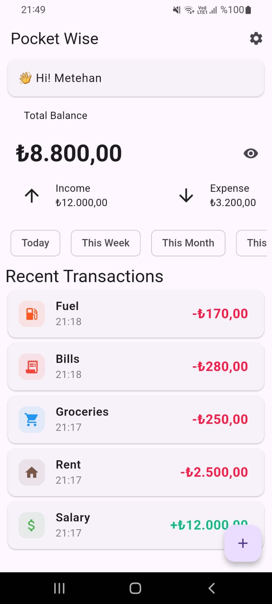
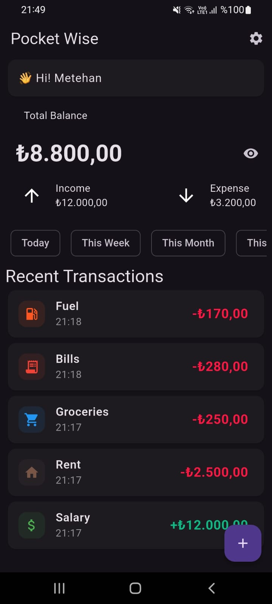
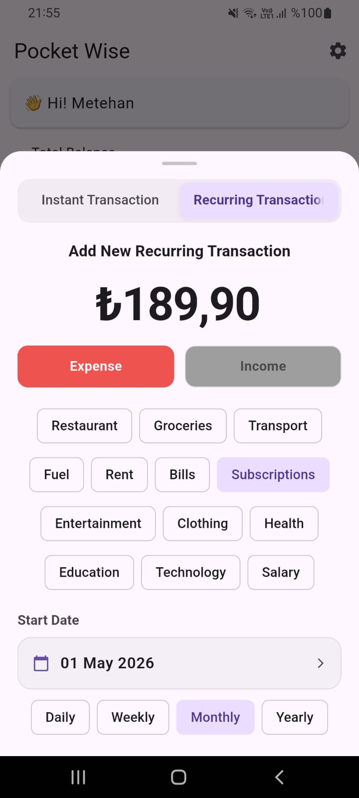
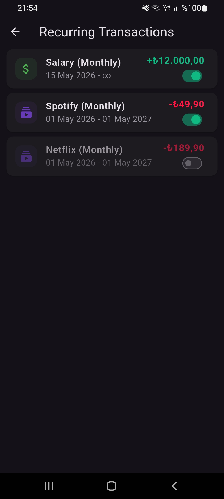
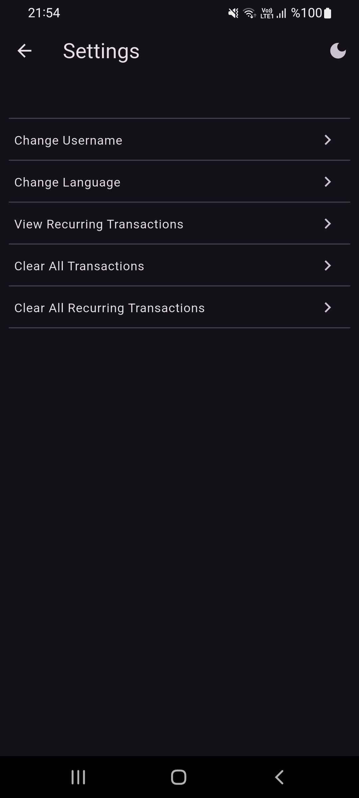
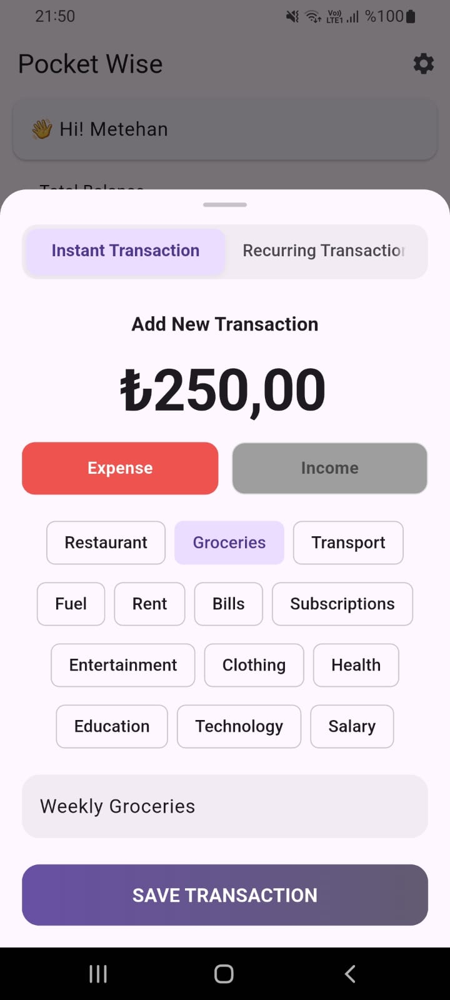

# 💰 PocketWise

A personal expense tracker built with Flutter. Track your income and expenses, automate recurring payments, and monitor your financial health.

## 📱 Screenshots

| Light Mode | Dark Mode |
|---|---|
|  |  |






## ✨ Features

- Add, edit, and delete income/expense transactions
- Recurring transactions (daily, weekly, monthly, yearly) with auto-processing
- Date-based filtering (today, this week, this month, this year)
- Total balance, income, and expense summary
- Balance visibility toggle
- Dark / light theme
- 4 language support (Turkish, English, German, Spanish)
- Data stored locally on device

## 🛠 Tech Stack

- **Flutter** — UI framework
- **Riverpod** — state management
- **SharedPreferences** — local storage
- **easy_localization** — multi-language support
- **intl** — currency and date formatting

## 🚀 Getting Started

```bash
git clone https://github.com/metehankarakaya/pocketwise.git
cd pocketwise
flutter pub get
flutter run
```

## 📋 Requirements

- Flutter 3.x
- Dart 3.x